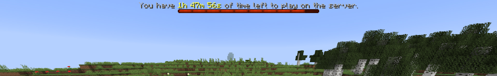

# PlayerTimeLimit

Original plugin and [documentation ](https://www.spigotmc.org/resources/playertimelimit-1-8-1-19.96577/)created by [ajneb97](https://github.com/Ajneb97/PlayerTimeLimit), fork and modifications created by Blarnix.

================================================================================================

##### **WARNING: At this point in time, none of code is remotely ready for use or tested. TEsting 123s**

---


##### **WHAT CAN I DO WITH PLAYERTIMELIMIT?**

This simple plugin allows you
to create a system in which players can play a limited amount of time in
 your server (or certain worlds), for example just 2 hours a day. This
idea of the plugin came originally from Youtube Minecraft series but it
can be used for other cases as well.

Players with no time left will be kicked from the server and they will
not be able to join again until the playtimes are reset. You can even
set time limits for each rank on your server!

##### **FEATURES**

* Kick players with no time left

- Prevent players with no time left joining the server

* Playtime limits per rank

- Define a specific reset time
- World whitelist system
- Boss Bar information message (1.9+)
- Action Bar information message
- Command to enable/disable information message
- Command to check remaining time for playtimes reset
- Command to check player time left and total time
- Command to add playtime to players
- Command to take playtime from players
- Command to reset playtime of players
- Notifications for players
- PlaceholderAPI variables
- Works with 1.8-1.18

*********Works only on Spigot/Paper (not craftbukkit)!*********



##### **TUTORIAL**

Download the plugin .jar and place it on your plugins folder. You don't need
to configure anything to use the plugin, just make sure to have a
permissions plugin to give access to players to some commands and set
them a specific playtime limit.

**Config.yml**

```yaml

# Whether the plugin should alert OP players of new plugin updates
# when joining the server.
update_notification: true

# Here you must define the amount of time (in seconds) a
# user can play on the server each day until playtimes are reset. You can
# create as many groups as necessary, and give the following permission
# to the players to apply a group: playertimelimit.limit.<group>
# default and op groups don't require permissions to be used.
# Set time to 0 for no time limit.
time_limits:
  default: 3600
  vip: 7200
  op: 0

# World whitelist system option that allows you to set the time limit only
# in certain worlds instead of the entire server.
world_whitelist_system:
   # Whether this system should be enabled or not.
    enabled: false

    # Worlds in which players will have the same time limit.
    worlds:
    - world
    - world_nether
    - world_the_end

    # Since the time limit works only in certain worlds, the player will not
    # be kicked from the server when its time run outs. Instead of that, they
    # will be teleported to another world. Here you must specify the specific
    # coordinates where you want the player to be teleported. Be sure not
    # to set a whitelisted world.
    # Format: world;x;y;z;yaw;pitch
    teleport_coordinates_on_kick: spawn;0;60;0;90;0

# Specific time when playtimes will be reset every day. Use the
# format "HH.MM"
reset_time: "00:00"

# If this option is enabled, the information message will show up to
# all players joining for the first time. If they want to hide it, they will
# need to use the /ptl message command
information_message_enabled_by_default: true

# Player data save interval in minutes.
data_save_time: 5

# Whether the time limit information message should appear in the
# action bar.
action_bar: false

# Whether the time limit information message should appear in the
# boss bar. Only works in 1.9+.
boss_bar:
    # If boss bar should be enabled or not.
    enabled: true

    # Color of the boss bar. Use colors from the following link:
    # https://hub.spigotmc.org/javadocs/spigot/org/bukkit/boss/BarColor.html
    color: RED

    # Style of the boss bar. Use styles from the following link:
    # https://hub.spigotmc.org/javadocs/spigot/org/bukkit/boss/BarStyle.html
    style: SEGMENTED_10

# This allows you to set notification messages when a player reaches
# a certain remaining playtime.
notification:
  # At 60 seconds of playtime remaining this message will be sent
  # to the player.
  60:
    message:
    - ""
    - "{centered}&c&lWARNING!"
    - "{centered}&cYou have &71 minute &cleft to play on the server."
    - ""
  30:
    message:
    - ""
    - "{centered}&c&lWARNING!"
    - "{centered}&cYou have &730 seconds &cleft to play on the server."
    - ""
```

##### **COMMANDS**

- /ptl message Enables or disables the time limit information message for yourself.
- /ptl info Checks the remaining time for playtimes reset.
- /ptl check (optional)`<player>` Checks player time left and total time.
- /ptl resettime `<player>` Resets playtime for a player.
- /ptl addtime `<player>` `<time>` Adds playtime to a player.
- /ptl taketime `<player>` `<time>` Takes playtime from a player.
- /ptl reload Reloads the config.

(alias: /playertimelimit)

##### **PERMISSIONS**

- playertimelimit.admin Access to all plugin commands.
- playertimelimit.command.message Access to /ptl message commands
- playertimelimit.command.info Access to /ptl info command.
- playertimelimit.command.check Access to /ptl check command.
- playertimelimit.command.check.others Access to /ptl check `<player>` command.
- playertimelimit.command.resettime Access to /ptl resettime command.
- playertimelimit.command.addtime Access to /ptl addtime command.
- playertimelimit.command.taketime Access to /ptl taketime command.
- playertimelimit.limit.`<group>` This permission will set a specific time limit defined in the config, for the player.

##### **SCREENSHOTS**

(TBD)

>>>>>>> 23f360e (translate and clean up classes)
>>>>>>>
>>>>>>
>>>>>
>>>>
>>>
>>
